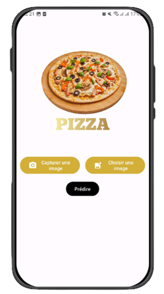
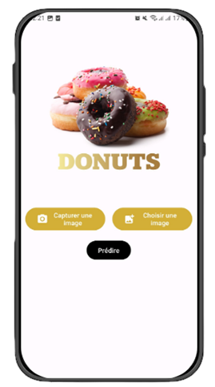
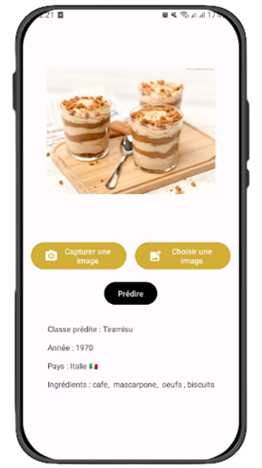
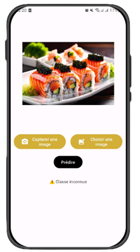

## 🛠️ Préparation pour Utiliser l'Application Mobile CFood

Avant d'utiliser l'application mobile **CFood**, quelques étapes sont nécessaires pour préparer votre environnement :

1. **Installer Android Studio** :  
   - Téléchargez Android Studio à partir du site officiel : [Android Studio](https://developer.android.com/studio).  
   - Suivez les étapes d'installation pour configurer l'environnement de développement.

2. **Activer les Options de Développement sur votre Téléphone** :  
   - Accédez aux paramètres de votre téléphone.  
   - Ouvrez la section "À propos du téléphone" ou "Informations sur l'appareil".  
   - Touchez 7 fois sur "Numéro de build" pour activer les options de développement (un message vous le confirmera).  
   - Retournez dans les paramètres et accédez à "Options de développement".  
   - Activez le mode "Débogage USB".

---

## 📱 L'Application Mobile CFood : Une Approche Innovante

**CFood** tire son nom de la combinaison de **"C" pour Classification** et **"Food" pour aliments**. Ce nom reflète son objectif principal : classifier et identifier des aliments à partir d’images. L'application met un accent particulier sur la **précision**, tout en offrant une expérience utilisateur **simple et intuitive**.  

Cette section explore les technologies utilisées et fournit une **démonstration de l'application**, illustrant son efficacité et son utilité.

---

### ⚙️ Technologies Utilisées

1. **Kotlin** :  
   - Kotlin est un langage moderne, open-source et fortement typé.  
   - Compatible avec la programmation orientée objet et fonctionnelle, il simplifie le développement Android grâce à sa syntaxe concise et puissante.

2. **TensorFlow Lite** :  
   - Une bibliothèque optimisée pour l’apprentissage automatique sur appareils mobiles.  
   - Permet de déployer des modèles légers en utilisant un minimum de ressources.  
   - Fonctionne localement, garantissant des performances rapides en temps réel, même sans connexion Internet.

---

### 📸 Démonstration de l'Application

#### 1. **Interface d'Accueil**  
   - La page d'accueil affiche une galerie de différents plats issus du dataset sous forme de vignettes.  
   - Le logo de l'application est placé au centre, offrant une navigation simple et intuitive.  
   - Après **2 secondes**, l'application passe automatiquement à l'interface suivante.

---

#### 2. **Interface de Sélection et Prédiction**  
   - En haut de l'écran, une liste d'images défile, représentant les différentes classes du dataset utilisées pour entraîner le modèle.  
   - Trois boutons principaux sont disponibles :  
     1. **Capturer une image** (via l'appareil photo).  
     2. **Importer une image** (depuis la galerie).  
     3. **Prédire** (effectuer une prédiction après capture/importation).
     
      

---

#### 3. **Interface de Résultats**  
   - L'image importée ou capturée remplace les images des classes affichées en haut.  
   - Si une classe est reconnue avec une probabilité supérieure au **seuil de 0.75**, les informations associées s’affichent :  
     - **Nom de la classe**  
     - **Pays d’origine**  
     - **Année de création**  
     - **Ingrédients**  
   - Exemple :  
     - Si une image de tiramisu est importée, l'application affichera les détails du tiramisu.
        
     - Si une image de sushi est importée (non incluse dans le dataset), le message **"Classe inconnue"** s'affichera.
        
